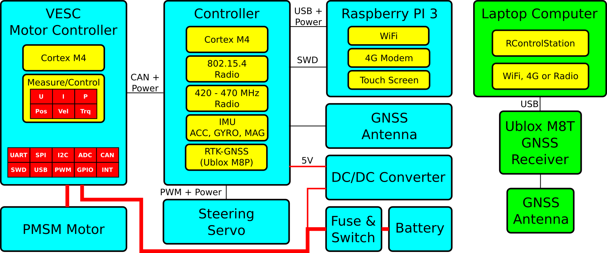
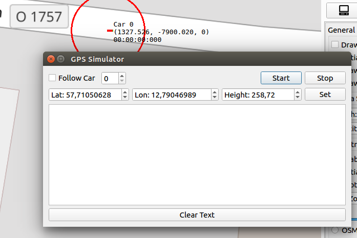

# The RISE Self-Driving Model Vehicle Platform (SDVP)

This is the source code and hardware design for a model vehicle platform developed and maintained at RISE Research Institutes of Sweden. The platform currently has full support for cars with Ackermann steering, robots with differential steering and partial support for quadcopters.

Self-Driving in this context means that the vehicles can follow a pre-programmed path outdoors accurately using RTK-GNSS. The paths can be edited using [RControlStation](Linux/RControlStation) as a set of points with different time stamps or velocities, depending on the mode. It is also possible to send paths to the vehicles with time stamps in real-time from external applications (either using UDP or TCP to RControlStation, or directly over a radio link) for e.g. following other vehicles.

Some details about the position estimation and the autopilot can be found in our [published article](https://www.hindawi.com/journals/jr/2018/4907536/).

Figure 1 shows a screenshot of RControlStation, which is a GUI where model vehicles can be viewed, configured and controlled in real time.


Here is a (quire outdated) video with a test of RISE SDVP on a model car:

[](http://www.youtube.com/watch?v=4wPVpvPP-8w "Tero RC car with autopilot and RTK-GPS")

## Repository Structure

The repository is organized as follows:

- **Documentation**  
    Contains Markdown files with documentation and tutorials, and the directories:
    - **PDF**  
    Contains generated PDFs from the markdown files. Will be cleared when the documentation is built.
    - **Pictures**  
    Contains photos and drawings, which are referenced in the documentation files.
- **Embedded**  
    Contains embedded software for various PCBs of the platform.
    - **Mote**  
    The software for the mote PCB, which can be used as a USB-to-802.15.4 bridge to communicate with the model cars.
    - **RC_Controller**  
    The software for the control PCB. This is where the sensor fusion, position estimation and autopilot for the car runs.
    - **uwb_board**  
    The software for the Ultra-wideband ranging boards.
- **Hardware**  
    KiCad PCB projects with the PCBs for the platform.
    - **Controller**  
    The PCB that is referred to as the controller in this documentation. The RC_Controller software runs on this one, and this is the main PCB that this platform is built on.
    - **RFMote_PA**  
    The USB-to-802.15.4 bridge mentioned above. Note that if an IP-connection with e.g. a raspberry pi is used, this one is not needed.
    - **uwb_pcb**  
    A PCB with a DWM1000 module, a STM32F4 microcontroller, a MPU9250 IMU, a CAN-transceiver and some DC/DC converters. The uwb_board software mentioned above runs on this one. This PCB is not needed, but it is useful for experimenting with UWB positioning.
- **Linux**  
    Contains Linux software, mostly written using the [Qt framework](https://www.qt.io/), for the platform.
    - **Car_Client**  
    This is a Qt command line program that can run on e.g. a raspberry pi, which is connected to the Controller PCB over USB. Car_Client provides a TCP bridge, which can be used to access the Controller over a network connection instead of a radio. Car_Client also runs the Chronos software (which might be documented later) and can simulate cars for development without having access to a model car. Car_Client can also connect to cameras supported by Video For Linux (V4L) and stream them as JPEG images to RControlStation.
    - **RControlStation**  
    This is a desktop program that can stream realtime data from the cars (including video), and edit trajectories for the model cars on top of OpenStreetMap. It can also act as a RTK base station, or connect to one. There are also many other functions, such as providing a TCP bridge to control cars and even emulating GPS signal using software-defined radio.
    - **RControlStationComm**  
    A C library that can be used to interface cars and trajectories from RControlStation, when using the TCP server in RControlStation.
    - **CarNetworkTester**  
    A test program where XML messages that can be decoded by RControlStation can be generated and sent, and the response can be studied. Useful for developing independent programs that interface with RControlStation and the model cars over TCP.
    - **scala_test**  
    Scala and java-based software to perform automatic testing of the model cars in real-time using ScalaCheck. RControlStationComm is used to interface with the cars and RControlStation. An interactive scala shell where the cars can be controlled, including the ability to generate trajectories to arbitrary points and orientations avoiding static obstacles, is also included. A paper where this is presented in detail is currently being written.
    - **Pi**  
    Scripts and UDEV rules for a raspberry pi (or similar) embedded Linux computer that is installed on a model car and runs Car_Client.

## Hardware

Figure 2 shows a hardware diagram of a working configuration of the RISE-SDVP platform. The cyan-colored boxes to the left are the components on a model car, and the green boxes to the right are a laptop computer connected over 4G to the model car. The laptop computer also runs a RTK-GNSS base station, so that the model car can position itself with around 3 cm accuracy relative to the GNSS antenna connected to the receiver on the laptop.



Here is a video that shows how a model car like the one in the block diagram above was built:

[](http://www.youtube.com/watch?v=nIqKJCZP5LM "Building a self-driving model car")

There are many different configuration of hardware components that can result in a working RISE SDVP model car. What they need to function in general is:

- The [Controller](Hardware/Controller), which runs the embedded software that controls the motion and estimates the position of the model car.
- A [VESC](https://vesc-project.com) motor controller that controls the motor on the car over CAN-bus, and provides speed and position estimation from the motor that is used in the sensor fusion in the controller.
- A computer that runs the [RControlStation](Linux/RControlStation) software.
- A way to communicate between the [Controller PCB](Hardware/Controller) and [RControlStation](Linux/RControlStation). The options are:
    - Using the embedded radios on the controller, and our [Radio Mote](Hardware/RFMote_PA) plugged in over USB to the computer running RControlStation.
    - Connecting the controller to an embedded Linux computer using USB, such as the [Raspberry PI](https://www.raspberrypi.org/), and running [Car_Client](Linux/Car_Client) on that computer. Then RControlStation can communicate with the controller over TCP using Car_Client. The TCP connection can then run over a network as usual, such as WiFi or 4G cellular. This is the method that we are using on the setup above.
- Correction data from a RTK-SN base station within 10 km from where the car operates. There is support for different sources of correction data, such as:
    - Connecting a supported GNSS receiver, such as the Ublox M8T or Ublox M8P, to the computer running RControlStation, and streaming correction data over that connection. This is what we do in the setup above.
    - Connecting to a NTRIP server. This can be done from RControlStation, or by passing an argument to Car_Client if it is used instead of a radio.
    - Our [Controller](Hardware/Controller) in base station mode, where it will transmit correction data over the 433 MHz radio.
- Other things that are (obviously) needed are motor, steering servo, power supplies and antennas.

## Steering Geometries

There is currently support for two different steering geometries: _Ackermann_ and _Differential_. In Ackermann steering mode there is one main motor driving the car, and a steering servo controlling the direction; whereas in differential mode there is one motor that drives the wheels on each side of the car and there is no steering servo. By default, the controller is configured for Ackermann steering, but that, and many other settings, can be changed in [conf_general.h](Embedded/RC_Controller/conf_general.h):

```
// Set to 1 to enable differential steering
#define HAS_DIFF_STEERING			1
// CAN ID of VESC motor controller for the left motor
#define DIFF_STEERING_VESC_LEFT		0
// CAN ID of VESC motor controller for the right motor
#define DIFF_STEERING_VESC_RIGHT	1
```

In addition to updating _conf_general.h_, geometry parameters for the car also have to be updated in RControlStation, as shown in Figure 3:


The most important parameters for Ackermann steering are listed in the following table. Some of them are not used in differential steering mode.

| Parameter      | Description             |
|--------------  |-----------------------------------------------------------------------------|
| Gear Ratio     | The ratio between one wheel revolution and one motor revolution.            |
| Turn Radius    | The radius of the circle the car follows at maximum steering angle.         |
| Wheel Diameter | Diameter of the model car wheels.                                           |
| Axis Distance  | Distance between front and rear wheel axis.                                 |
| Motor Poles    | Number of motor poles. Usually 2 or 4 for inrunners.                        |
| Servo Center   | PWM signal to output to steering servo when going straight [0 - 1].         |
| Servo Range    | Steering range. Negative numbers invert the servo direction [-1 - 1].       |

It is important to get these parameters correct, as they have a large impact on the position estimation and autopilot.

## Simulation Mode

It is possible to test the platform without having access to any other hardware than a computer. This can be done by running [Car_Client](Linux/Car_Client) with the following flags:

```
./Car_Client --usetcp --simulatecars 1:0
```

This will simulate a model car locally, including the autopilot. Then RControlStation can connecto to localhost over TCP and control the simulated car as if it were an actual model car. Car_Client accepts several different flags that affect the simulation; all flags can be listed using the -h argument:

```
./Car_Client -h
```

## Setting up a Raspberry Pi 3 Image to run Car_Client

A somewhat pre-configured image for the Raspberry PI 3 can be downloaded [here](http://home.vedder.se/rise_sdvp/pi_img.zip). The login credentials on the image are:

```
User: elpgem
Password: elpgem1
```

Starting by changing the password is a good idea.

Once the image is up and running, the repository should be updated to the latest version:

```
cd ~/rise_sdvp
git pull
```

At boot there is a screen session that starts automatically that runs Car_Client. Before rebuilding Car_Client, the screen session should be stopped with

```
killall screen
```

Then Car_Client should be rebuilt

```
cd ~/rise_sdvp/Linux/Car_Client
qmake -qt=5 DEFINES+=HAS_CAMERA
make clean
make
```
After that Car_Client can be started, and a connection can be made from RControlStation:

```
./Car_Client -p /dev/car --useudp --logusb --usetcp
```

Notice that there are udev rules that map the USB-serial device of the Controller to _/dev/car_

The next time the raspberry pi boots it will start a screen session with Car_Client. This is done from the ~/start_screen script. It might be a good idea to check if the Car_Client command in that script has the correct arguments for the latest version of rise_sdvp. At this time it should be

```
screen -d -m -S car bash -c 'cd /home/pi/rise_sdvp/Linux/Car_Client && ./Car_Client -p /dev/car --useudp --logusb --usetcp ; bash'
```

## GPS Emulation using Software-Defined Radio (SDR)

RControlStation also supports generation GPS signals using the [Lime SDR](https://www.crowdsupply.com/lime-micro/limesdr-mini). This is work in progress and planned to be useful for automatic HIL testing in the future, but it might be nice to play around with if you have access to a Lime SDR. In order to use it, the [Lime Suite](https://wiki.myriadrf.org/Lime_Suite) has to be installed on your system. Once that is done, RControlStation can be build with Lime SDR support by uncommenting the following line in RControlStation.pro:

```
# Lime SDR support
#DEFINES += HAS_LIME_SDR
```

Once RControlStation is compiled with Lime SDR support, a real-time GPS simulation can be started from _Tests -> GPS Simulator_, which will show the dialog in Figure 4:



The desired latitude, longitude and height can then simply be set in the dialog. It is also possible to follow a model car and generate its perceived position. The [simulation mode](#SimulationMode) can also be used in combination with the GPS Emulator, making it possible to generate GPS signal for a virtual vehicle in real-time.

## User Guides, Tutorials and other Resources
- A work-in-progress user guide with several details on how to use RControlStation can be found [here](https://github.com/svenssonjoel/rise_sdvp_documentation/raw/master/RControlStationManual/RControlStation_doc_version_0_1.pdf).
- A tutorial on how to implement new functionality both in the embedded control software and in RControlStation can be found [here](https://github.com/svenssonjoel/rise_sdvp_documentation/raw/master/EmbeddedProgrammingExample/main.pdf)
- Our [published article](https://www.hindawi.com/journals/jr/2018/4907536/)

