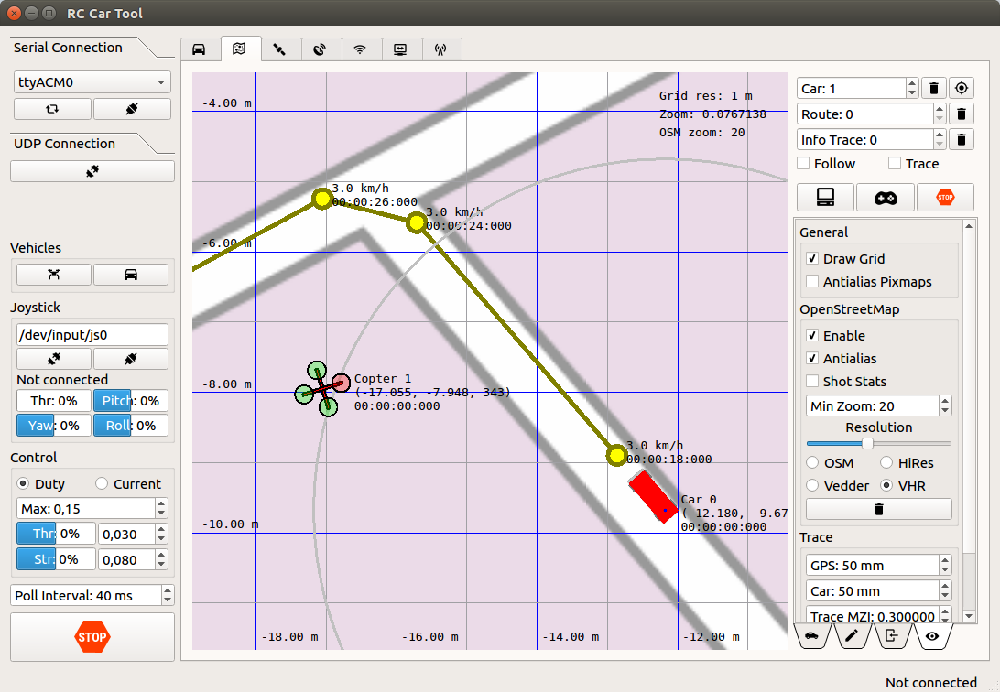

# The RISE Self-Driving Model Vehicle Platform (SDVP)

This is the source code and hardware design for a model vehicle platform developed and maintained at RISE Research Institutes of Sweden. The platform currently has full support for cars with Ackermann steering, robots with differential steering and partial support for quadcopters.  

Self-Driving in this context means that the vehicles can follow a pre-programmed path outdoors accurately using RTK-GNSS. The paths can be edited using RControlStation as a set of points with different time stamps or velocities depending on the mode. It is also possible to send paths to the vehicles with time stamps in real-time from external applications (either using UDP or TCP to RControlStation or directly over a radio link) for e.g. following other vehicles.  

Some details about the position estimation and the autopilot can be found in our [published article](https://www.hindawi.com/journals/jr/2018/4907536/).  

Figure 1 shows a screenshot of RControlStation, which is a GUI where model vehicles can be viewed, configured and controlled in real time.

Here is a video with a short test of the SDVP on a Tero RC car:

Currently a lot of documentation is missing, but this will be added over time along with tutorials on how to use this platform. The content of the documentation directory is incomplete and out of date, so don't rely on it too much.

